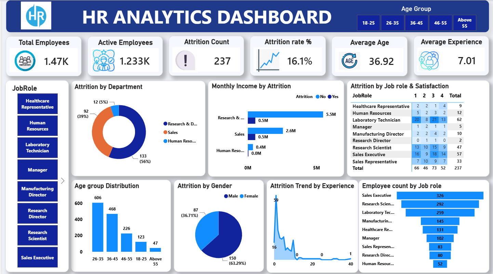

# HR Analytics Dashboard — Power BI

## Project Overview

This project analyses employee attrition and workforce composition using the IBM HR Analytics Employee Attrition & Performance dataset sourced from Kaggle. Unlike previous projects in this portfolio that combined SQL with Power BI, this project was built entirely within Power BI — using Power Query for data preparation and DAX for custom measures — to demonstrate the ability to deliver a complete analytical solution directly from raw Excel data.

The dashboard is designed to help HR teams and business leaders understand who is leaving, which departments and roles are most affected, and what workforce patterns underlie attrition trends.

---

## Tools & Techniques

| Area | Tool / Technique |
|---|---|
| Data source | IBM HR Analytics dataset (Excel, Kaggle) |
| Data preparation | Power Query (data types, column renaming, value replacement, conditional columns) |
| Measures | DAX (CALCULATE, DIVIDE, COUNTROWS) |
| Visualisation | Power BI Desktop |
| Dashboard pages | Single page — HR Analytics Dashboard |

---

## Data Preparation (Power Query)

Before building the dashboard, the raw Excel data was cleaned and shaped in Power Query:

- **Data type corrections** — ensured numeric, text, and boolean fields were correctly typed for accurate aggregation
- **Column renaming** — standardised field names for clarity in visuals and measures (e.g. removing underscores, improving readability)
- **Value replacement** — replaced coded or abbreviated values with descriptive labels for cleaner visual display
- **Conditional/calculated columns** — created derived columns such as age group banding to support demographic segmentation in visuals

---

## DAX Measures

Custom DAX measures were written to drive the KPI cards and attrition calculations across the dashboard:

- **Attrition Count** — `COUNTROWS` filtered to employees where Attrition = "Yes"
- **Attrition Rate %** — `DIVIDE` of Attrition Count by Total Employees, formatted as a percentage
- **Active Employees** — Total Employees minus Attrition Count
- **Average Age** and **Average Experience** — supporting workforce profile KPIs

---

## Dashboard — HR Analytics Dashboard

The single-page dashboard provides a complete view of attrition and workforce composition, with an Age Group slicer enabling filtered analysis across all visuals.

**KPI Cards (top row):**
- Total Employees: **1,470**
- Active Employees: **1,233**
- Attrition Count: **237**
- Attrition Rate: **16.1%**
- Average Age: **36.92**
- Average Experience: **7.01 years**

**Visuals:**

- **Attrition by Department** (donut chart) — Sales accounts for **56% of all attrition** (133 employees), Research & Development for 39% (92), and Human Resources for 5% (12)
- **Monthly Income by Attrition** (bar chart) — Research & Development employees who stayed earn significantly more (5.5M) compared to those who left (0.5M), suggesting income is a retention factor; Sales shows a similar but smaller gap (2.6M vs 0.5M)
- **Attrition by Job Role & Satisfaction** (matrix) — Laboratory Technicians have the highest attrition (62), followed by Sales Executives (57) and Research Scientists (47); satisfaction score 3 accounts for the highest attrition count (73) across all roles
- **Age Group Distribution** (bar chart) — The 26–35 age group is the largest workforce segment (606 employees), followed by 36–45 (468)
- **Attrition by Gender** (pie chart) — Males account for **63.29%** of attrition (150) vs **36.71%** female (87)
- **Attrition Trend by Experience** (area chart) — A sharp attrition spike of **59 employees** occurs at 0–1 years of experience, dropping steeply thereafter, indicating early-career retention as the primary risk window
- **Employee Count by Job Role** (bar chart) — Sales Executives (326) and Research Scientists (292) are the two largest roles by headcount
- **Job Role slicer** (left panel) — Allows filtering all visuals by individual job role

---

## Power BI File

The full dashboard file is available in this repository:
[HR_Analytics_Dashboard.pbix](PowerBI/HR_Analytics_Dashboard.pbix)

---

## Screenshots

### HR Analytics Dashboard

---

## Key Insights

1. **Early-career attrition is the biggest retention risk** — 59 employees left within their first year, the sharpest attrition point across the entire experience curve. Onboarding and early engagement programmes should be prioritised.

2. **Sales department drives over half of all attrition** — At 56% of total attrition, Sales is the highest-risk department. Combined with lower monthly income relative to R&D, compensation competitiveness in Sales warrants review.

3. **Income gap correlates with retention** — Employees who stayed in Research & Development earn significantly more than those who left. This pattern holds across departments and suggests that below-market pay is a material attrition driver.

4. **Laboratory Technicians are the most at-risk job role** — With 62 departures and high counts across all satisfaction levels, attrition in this role does not appear to be purely satisfaction-driven and may reflect external market demand or career progression gaps.

5. **Male employees account for nearly two-thirds of attrition** — At 63.29%, this likely reflects the gender composition of higher-risk roles (e.g. Sales, Laboratory) rather than gender-specific dissatisfaction, but warrants further investigation.

---

## Dataset

- **Source:** [IBM HR Analytics Employee Attrition & Performance — Kaggle](https://www.kaggle.com/datasets/pavansubhasht/ibm-hr-analytics-attrition-dataset)
- **Rows:** 1,470 employee records
- **Key fields:** Age, Department, JobRole, Attrition, MonthlyIncome, YearsAtCompany, JobSatisfaction, Gender, EducationField, OverTime

---

## Related Projects

- [Project 1 — Supply Chain Performance Analysis (SQL + Power BI)](https://github.com/jurgensp09-ship-it/Supply-Chain-SQL-Analysis)
- [Project 2 — Sales & Employee Performance Analysis (SQL + Power BI)](https://github.com/jurgensp09-ship-it/Sales-Employee-Performance-SQL-PowerBI)
- [Project 3 — HR Analytics (SQL + Power BI)](https://github.com/jurgensp09-ship-it/HR-Analytics-SQL-PowerBI)
- [Project 4 — Inventory Analytics (SQL + Power BI)](https://github.com/jurgensp09-ship-it/Inventory-Analytics-SQL-PowerBI)

